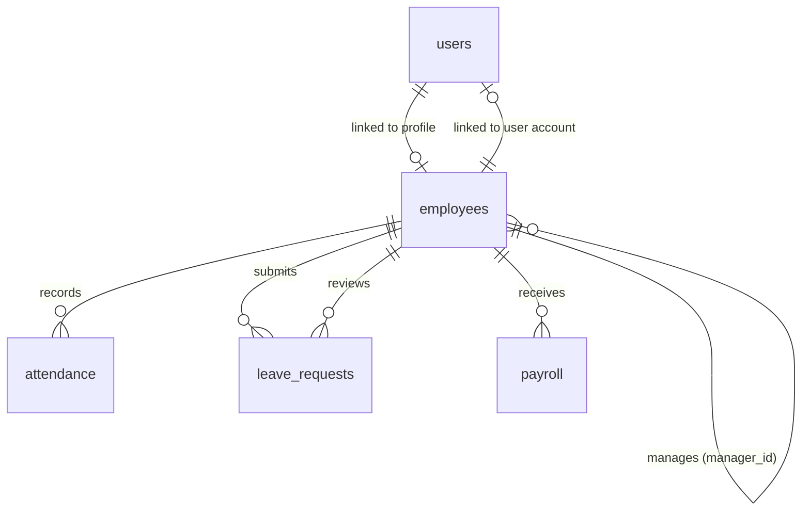

# HR Core Database Schema Specification

## Entities Overview

---

## Data Models Specification

### 1. `users` Table
Identity & authentication credentials for system access.

| Column | Type | Constraints | Description |
|---|---|---|---|
| `id` | VARCHAR(36) | PRIMARY KEY | UUID v4 |
| `employee_id` | VARCHAR(36) | FK -> `employees.id` (SET NULL) | Linked employee profile |
| `email` | VARCHAR(255) | UNIQUE, INDEX, NOT NULL | User email address |
| `password_hash` | VARCHAR(255) | NOT NULL | Bcrypt hashed password |
| `role` | VARCHAR(50) | NOT NULL | Enum: `EMPLOYEE`, `ADMIN`, `HR` |
| `is_active` | BOOLEAN | NOT NULL, DEFAULT True | Active account flag |
| `is_verified` | BOOLEAN | NOT NULL, DEFAULT False | Email verification flag |
| `created_at` | TIMESTAMPTZ | NOT NULL | Timestamp created |
| `updated_at` | TIMESTAMPTZ | NOT NULL | Timestamp last updated |
| `last_login_at` | TIMESTAMPTZ | NULL | Timestamp of last login |

---

### 2. `employees` Table
Core HR Employee profile records.

| Column | Type | Constraints | Description |
|---|---|---|---|
| `id` | VARCHAR(36) | PRIMARY KEY | UUID v4 |
| `user_id` | VARCHAR(36) | UNIQUE, FK -> `users.id` (SET NULL) | Linked system user |
| `employee_code` | VARCHAR(50) | UNIQUE, INDEX, NOT NULL | Unique HR Code (e.g. EMP001) |
| `first_name` | VARCHAR(100) | NOT NULL | First Name |
| `last_name` | VARCHAR(100) | NOT NULL | Last Name |
| `email` | VARCHAR(255) | UNIQUE, INDEX, NOT NULL | Work Email Address |
| `phone` | VARCHAR(50) | NULL | Phone Number |
| `department` | VARCHAR(100) | NOT NULL | Department Name |
| `designation` | VARCHAR(100) | NOT NULL | Job Title |
| `date_of_joining` | DATE | NOT NULL | Employment start date |
| `employment_status` | VARCHAR(50) | NOT NULL | Enum: `FULL_TIME`, `PART_TIME`, `CONTRACT`, `PROBATION`, `TERMINATED` |
| `manager_id` | VARCHAR(36) | FK -> `employees.id` (SET NULL) | Reporting Manager ID |
| `created_at` | TIMESTAMPTZ | NOT NULL | Timestamp created |
| `updated_at` | TIMESTAMPTZ | NOT NULL | Timestamp last updated |

---

### 3. `attendance` Table
Daily check-in / check-out records and status tracking.

| Column | Type | Constraints | Description |
|---|---|---|---|
| `id` | VARCHAR(36) | PRIMARY KEY | UUID v4 |
| `employee_id` | VARCHAR(36) | FK -> `employees.id` (CASCADE), INDEX, NOT NULL | Employee ID |
| `attendance_date` | DATE | INDEX, NOT NULL | Attendance Date |
| `check_in` | TIMESTAMPTZ | NULL | Time checked in |
| `check_out` | TIMESTAMPTZ | NULL | Time checked out |
| `status` | VARCHAR(50) | NOT NULL | Enum: `PRESENT`, `ABSENT`, `HALF_DAY`, `LATE`, `ON_LEAVE` |
| `created_at` | TIMESTAMPTZ | NOT NULL | Timestamp created |
| `updated_at` | TIMESTAMPTZ | NOT NULL | Timestamp last updated |

**Constraints**:
- `uq_employee_attendance_date`: Unique (`employee_id`, `attendance_date`)
- `chk_attendance_check_out`: CHECK (`check_out >= check_in` OR `check_out IS NULL`)

---

### 4. `leave_requests` Table
Employee leave applications, approvals, and reviewer comments.

| Column | Type | Constraints | Description |
|---|---|---|---|
| `id` | VARCHAR(36) | PRIMARY KEY | UUID v4 |
| `employee_id` | VARCHAR(36) | FK -> `employees.id` (CASCADE), INDEX, NOT NULL | Applicant Employee ID |
| `leave_type` | VARCHAR(50) | NOT NULL | Enum: `SICK`, `CASUAL`, `ANNUAL`, `MATERNITY`, `PATERNITY`, `UNPAID` |
| `start_date` | DATE | NOT NULL | Leave start date |
| `end_date` | DATE | NOT NULL | Leave end date |
| `reason` | TEXT | NULL | Reason for leave |
| `status` | VARCHAR(50) | INDEX, NOT NULL | Enum: `PENDING`, `APPROVED`, `REJECTED`, `CANCELLED` |
| `reviewed_by` | VARCHAR(36) | FK -> `employees.id` (SET NULL), NULL | Reviewer Employee ID |
| `reviewed_at` | TIMESTAMPTZ | NULL | Timestamp reviewed |
| `review_comment` | TEXT | NULL | Reviewer feedback/comment |
| `created_at` | TIMESTAMPTZ | NOT NULL | Timestamp created |
| `updated_at` | TIMESTAMPTZ | NOT NULL | Timestamp last updated |

**Constraints**:
- `chk_leave_dates`: CHECK (`end_date >= start_date`)

---

### 5. `payroll` Table
Employee salary records per pay period.

| Column | Type | Constraints | Description |
|---|---|---|---|
| `id` | VARCHAR(36) | PRIMARY KEY | UUID v4 |
| `employee_id` | VARCHAR(36) | FK -> `employees.id` (CASCADE), INDEX, NOT NULL | Employee ID |
| `pay_period` | VARCHAR(7) | INDEX, NOT NULL | Pay Period e.g. "2026-08" |
| `basic_salary` | NUMERIC(12, 2) | NOT NULL | Base Salary |
| `allowances` | NUMERIC(12, 2) | DEFAULT 0.00, NOT NULL | Allowances |
| `deductions` | NUMERIC(12, 2) | DEFAULT 0.00, NOT NULL | Deductions |
| `gross_salary` | NUMERIC(12, 2) | NOT NULL | Gross Salary |
| `net_salary` | NUMERIC(12, 2) | NOT NULL | Net Salary |
| `currency` | VARCHAR(3) | DEFAULT 'USD', NOT NULL | Currency code |
| `created_at` | TIMESTAMPTZ | NOT NULL | Timestamp created |
| `updated_at` | TIMESTAMPTZ | NOT NULL | Timestamp last updated |

**Constraints**:
- `uq_employee_pay_period`: Unique (`employee_id`, `pay_period`)
